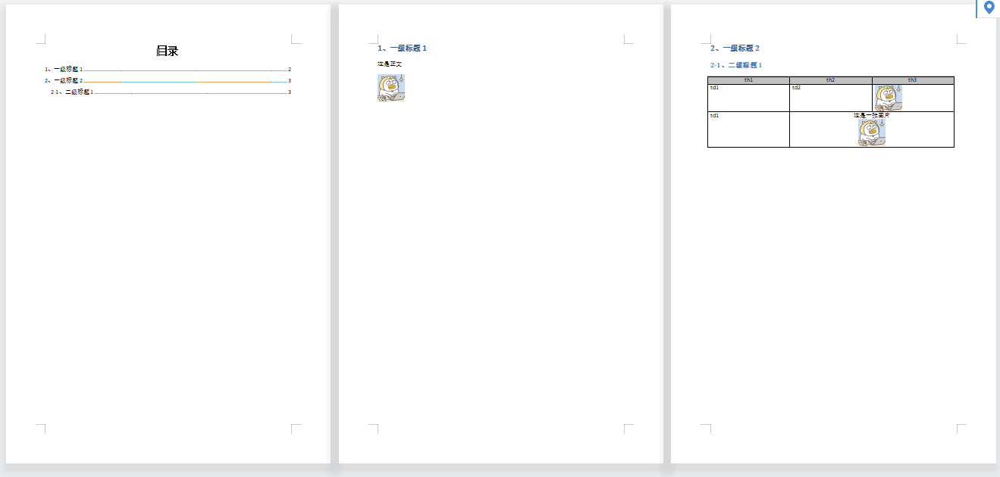
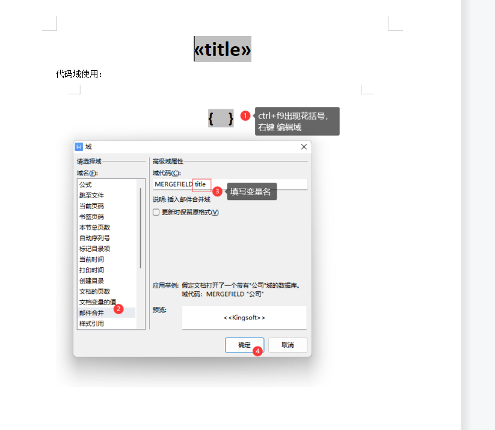
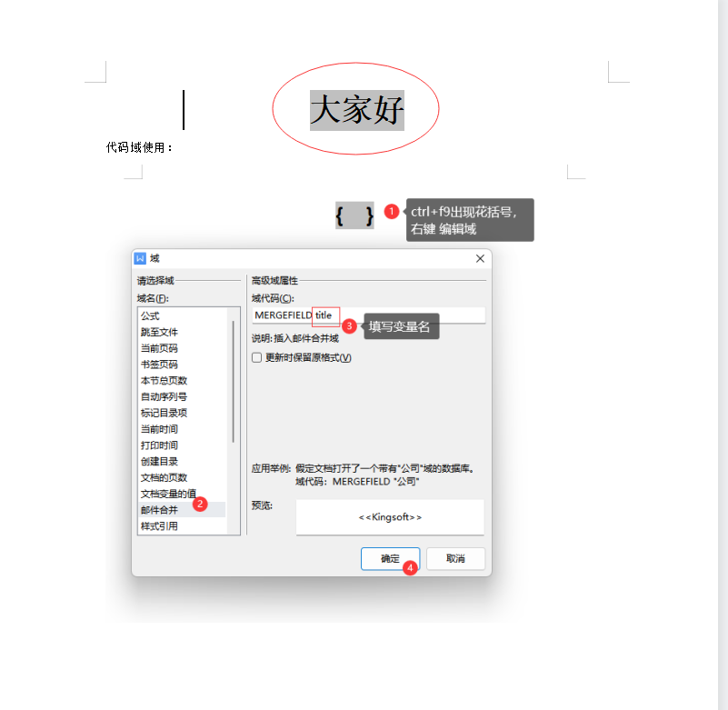

# docx-op
Stop talking, show me code.

`src/test/java/DocxTest.java`
~~~java
public class DocxTest {

    /**
     * 创建word
     */
    @Test
    public void createDocx() {
        // 创建word画家
        DocxPainter docxPainter = new DocxPainter();
        // 准备图片
        DocxImage docxImage = this.prepareImage();
        // 准备表格
        DocxTable docxTable = this.prepareTable(docxPainter);
        // 画word
        docxPainter
                // 添加目录
                .addToc(DocxFactory.createParagraph(new DocxText("目录", DocxStyleEnum.DEFAULT_TOC_TITLE.getDocxStyle())))
                // 开启新一页
                .add(DocxFactory.newPage())
                // 添加标题
                .add(DocxFactory.createHeading("Heading1", new DocxText("1、一级标题1")))
                // 添加正文
                .add(DocxFactory.createParagraph(new DocxText("这是正文")))
                // 添加图片
                .add(DocxFactory.createParagraph(docxImage, docxPainter.getWpk()))
                // 开启新一页
                .add(DocxFactory.newPage())
                // 添加标题
                .add(DocxFactory.createHeading("Heading1", new DocxText("2、一级标题2")))
                // 添加2级标题
                .add(DocxFactory.createHeading("Heading2", new DocxText("2-1、二级标题1")))
                // 添加表格
                .add(DocxFactory.createTable(docxTable, docxPainter.getWpk()))
                // 保存
                .save(new File("docx/1.docx"));
    }

    /**
     * 通过模板创建word
     * 支持使用word 的代码域（邮件合并）标记占位符
     */
    @Test
    public void createDocxByTemplate() {
        Map<DataFieldName, String> ctx = new HashMap<>();
        ctx.put(new DataFieldName("title"), "大家好");

        // 通过传入已有的word文件，从文末继续画word
        DocxPainter docxPainter = new DocxPainter(new File("docx/template.docx"));
        docxPainter
                // 执行模板渲染
                .processTemplate(ctx)
                // 开启新一页
                .add(DocxFactory.newPage())
                // 添加标题
                .add(DocxFactory.createHeading("Heading1", new DocxText("1、一级标题1")))
                // 添加正文
                .add(DocxFactory.createParagraph(new DocxText("这是正文")))
                // 保存
                .save(new File("docx/template-result.docx"));
    }

    /**
     * 准备图片
     *
     * @return {@link DocxImage}
     */
    private DocxImage prepareImage() {
        try {
            byte[] bytes = DocxFactory.readImage(Files.newInputStream(Paths.get("docx/money.jpg")), true);
            DocxImage docxImage = new DocxImage(bytes);
            docxImage.setWidth(1000L);
            return docxImage;
        } catch (IOException e) {
            throw new RuntimeException(e);
        }
    }

    /**
     * 准备表
     *
     * @param docxPainter 多克斯画家
     * @return {@link DocxTable}
     */
    private DocxTable prepareTable(DocxPainter docxPainter) {
        // 搞张图片
        DocxImage docxImage = this.prepareImage();
        // 行（注意：行里的列数要保持一致，样式是 行->列->内容 传递的）
        List<DocxRow> rows = new ArrayList<>();
        DocxRow headRow = new DocxRow(new ArrayList<DocxCell>() {{
            add(new DocxCell(new DocxText("th1")));
            add(new DocxCell(new DocxText("th2")));
            add(new DocxCell(new DocxText("th3")));
            // 给Row设置不一样的样式来表示表头
        }}, DocxStyle.builder().cellColor("C0C0C0").align(JcEnumeration.CENTER).build());
        DocxRow row1 = new DocxRow(new ArrayList<DocxCell>() {{
            add(new DocxCell(new DocxText("td1")));
            add(new DocxCell(new DocxText("td2")));
            // 图片单元格
            add(new DocxCell(docxImage));
        }});
        DocxRow row2 = new DocxRow(new ArrayList<DocxCell>() {{
            add(new DocxCell(new DocxText("td1")));
            // 复杂单元格
            List
 pList = new ArrayList<>();
            pList.add(DocxFactory.createParagraph(new DocxText("这是一张图片")));
            pList.add(DocxFactory.createParagraph(docxImage, docxPainter.getWpk()));
            // 横向合并单元格
            add(new DocxCell(pList, DocxStyle.builder().hMerge(TbMergeEnum.RESTART).align(JcEnumeration.CENTER).build()));
            add(new DocxCell(new DocxText(""), DocxStyle.builder().hMerge(TbMergeEnum.CONTINUE).build()));
        }});
        rows.add(headRow);
        rows.add(row1);
        rows.add(row2);
        return new DocxTable(rows);
    }
}
~~~

`createDocx`

`createDocxByTemplate`

